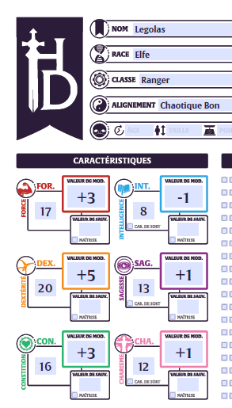

# TestPdfMauiApp
 
Ce petit exemple montre l'utilisation du PdfStamper de iTextSharp pour modifier les champs d'un PDF éditable, dans une application .net MAUI.

La première étape consiste à inclure la lib iTextSharp dans le projet :

```
dotnet add package XamiTextSharpLGPLv2 --version 1.0.0
```

J'utilise ici un package sous licence LGPL, car utilisant une ancienne version d'iTextSharp qui était encore sous LGPL.

Selon le type de projet et les fonctionnalités souhaitées, il pourra être nécessaire d'utiliser une version plus récente, iText 5 ou iText 7, disponibles sous licences AGPL ou payante.

Dans l'exemple lié à cet article, le fichier PDF éditable est inclus dans le projet en tant que "Ressource incorporée", ce qui permet à l'application d'être indépendante d'un quelconque serveur.

Pour lire une ressource incorporée, il suffit de procéder ainsi :

```csharp
var assembly = typeof(MainPage).GetTypeInfo().Assembly;
var inputStream = assembly.GetManifestResourceStream("TestPdfMauiApp.Resources.feuille_de_personnage_editable.pdf");
```

On pourrait utiliser n'importe quelle class de l'application courante plutôt que MainPage pour récupérer le bon assembly.

Maintenant que nous avons un stream vers le PDF éditable, nous pouvons l'ouvrir avec iTextSharp :

```csharp
var reader = new PdfReader(inputStream);
```

Pour créer le PdfStamper qui va nous permettre de modifier les champs éditables, il nous faut également un stream de sortie.

Comme nous sommes dans une appli MAUI, la lib MAUI Essentials contient tout ce qui nous intéresse :

```csharp
var outputFilename = Path.Combine(FileSystem.CacheDirectory, "feuille_de_personnage_modifiee.pdf");
var outputStream = File.Create(outputFilename)
```

Le fichier de destination sera donc créé dans le répertoire cache de l'application.

```csharp
var stamper = new PdfStamper(reader, outputStream);
```

Maintenant que nous avons notre stamper, nous pouvons lister tous les champs éditables du PDF :

```csharp
var form = stamper.AcroFields;
var fields = form.Fields;
foreach (DictionaryEntry field in fields)
{
    var item = field.Value as AcroFields.Item;
    Debug.WriteLine(field.Key);
    form.SetField(field.Key.ToString(), field.Key.ToString());
}
```

Au passage, nous avons rempli chaque champ éditable avec son propre nom, ce qui permet ensuite de bien les identifier. Utile si vous n'êtes pas le créateur du PDF utilisé !

Et enfin, rien de plus simple que de compléter notre PDF dynamiquement avec des valeurs voulues :

```csharp
form.SetField("Nom", "Legolas");
form.SetField("Niveau", "5");
form.SetField("Race", "Elfe");
form.SetField("Classe", "Ranger");
form.SetField("Alignement", "Chaotique Bon");
form.SetField("Historique", "");
form.SetField("Trait de personnalité",
   "Fils de Thranduil\n\n" +
   "Compagnon de l'Anneau\n\n" +
   "Ami des Nains"
   );
form.SetField("For Valeur", "17");
form.SetField("For MOD", "+3");
form.SetField("Dex Valeur", "20");
form.SetField("Dex MOD", "+5");
form.SetField("Con Valeur", "16");
form.SetField("Con MOD", "+3");
form.SetField("Int Valeur", "8");
form.SetField("Int MOD", "-1");
form.SetField("Sag Valeur", "13");
form.SetField("Sag MOD", "+1");
form.SetField("Cha Valeur", "12");
form.SetField("Cha MOD", "+1");
```

Et voilà !

Evidemment, ne pas oublier de bien refermer tous les objets utilisés, que ce soient les streams ou le PdfStamper ou le PdfReader, ces 2 derniers n'étant pas des objets disposables dans cette version de la lib. Un oubli entrainerait des complications possibles pour faire ouvrir votre fichier fraichement créé dans une autre application !

Pour l'afficher dans une application externe, rien de plus simple :

```csharp
Launcher.OpenAsync(new OpenFileRequest { File = new ReadOnlyFile(outputFilename) });
```



[feuille_de_personnage_editable.pdf](TestPdfMauiApp/Resources/feuille_de_personnage_editable.pdf)

[feuille_de_personnage_modifiee.pdf](feuille_de_personnage_modifiee.pdf)

Je reviendrai dans un prochain article sur l'utilisation de cette lib iTextSharp pour créer un PDF à partir de rien, mais pas tout de suite, j'ai plusieurs autres sujets à suivre avant.
